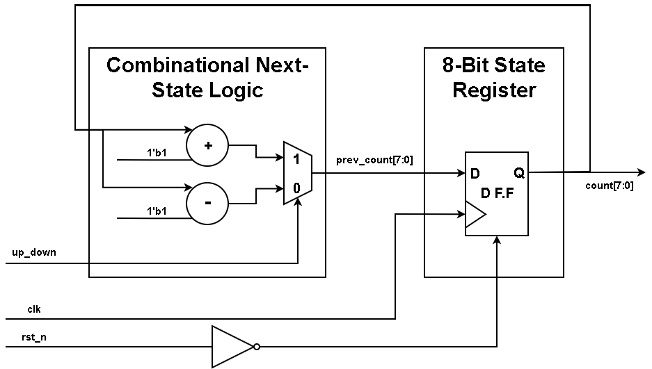
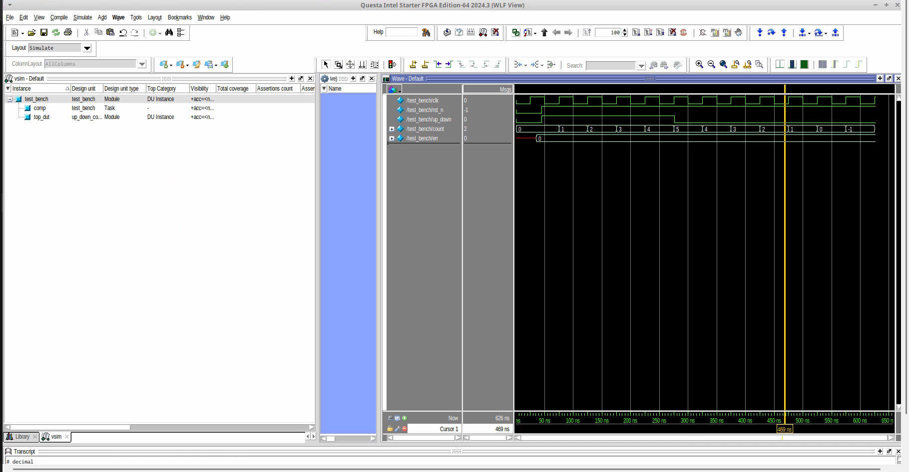
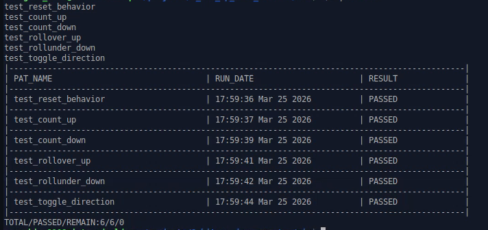
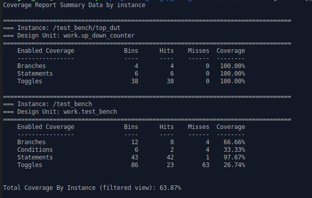

# 🚀 8-Bit Synchronous Up/Down Counter

An 8-bit Synchronous Up/Down Counter designed using behavioral modeling in SystemVerilog. I built this project to mark my transition from purely combinational logic (Adders) to **Sequential Logic Design**. My main focus was on understanding clock domains, state retention using Flip-Flops, reset handling, and task-based verification for time-dependent hardware behavior.

### 📦 Technologies

* **RTL Design:** SystemVerilog (`always_ff`, `always_comb`, `logic` types)
* **Architecture:** Behavioral Modeling, Sequential Logic, Finite State Machine (FSM) basics
* **Verification:** QuestaSim, ModelSim, Verilator (Linting)
* **Environment & OS:** Linux (Ubuntu), VIM
* **Methodology:** Directed Testing, Task-based Testbench, Coverage-Driven Verification, Makefiles

### ⚙️ IP Features

Here's what makes this sequential logic block function:
* **Synchronous Edge-Triggered:** All state changes (counting) occur strictly on the positive edge of the system clock (`clk`), ensuring stable and predictable data flow.
* **Bidirectional Counting:** A single control signal (`up_down`) seamlessly switches the counter's direction between incrementing and decrementing.
* **Robust Reset Mechanism:** Implements an active-low reset (`rst_n`) to immediately clear the internal state registers to zero, a critical requirement for power-on initialization.
* **Automatic Rollover/Rollunder:** Naturally handles bit-width boundaries by wrapping around from `255 -> 0` (Overflow) and `0 -> 255` (Underflow) without entering invalid states.

### 📐 Hardware Specifications (Spec)

The 8-bit Up/Down Counter is designed with the following port interfaces and functional constraints:

**1. Input/Output Ports:**

| Port Name | Direction | Width | Description |
| :--- | :--- | :--- | :--- |
| `clk` | Input | 1-bit | System Clock. Counter triggers on the positive edge. |
| `rst_n` | Input | 1-bit | Active-low Reset. Clears the counter to 0 when pulled low. |
| `up_down` | Input | 1-bit | Control Signal: `1` = Count Up, `0` = Count Down. |
| `count` | Output | 8-bit | Current value of the counter (0 to 255). |

**2. Functional Description:**
* If `rst_n == 0`: `count` is forced to `8'b00000000`.
* If `rst_n == 1` and `up_down == 1`: `count` increments by 1 on every `posedge clk`.
* If `rst_n == 1` and `up_down == 0`: `count` decrements by 1 on every `posedge clk`.
* **Rollover:** When `count == 8'hFF` (255) and counting UP, the next state is `8'h00` (0).
* **Rollunder:** When `count == 8'h00` (0) and counting DOWN, the next state is `8'hFF` (255).

**3. Architecture Block Diagram:**

  

### 🦉 The Process

Transitioning from combinational to sequential logic required a major mindset shift. I upgraded my coding language from Verilog to **SystemVerilog**, utilizing `always_ff` for the state registers and `logic` data types to prevent multi-driver issues.

Writing the RTL was straightforward, but the Verification phase was entirely different from my previous projects. Since sequential logic depends on the timeline, I couldn't just throw an exhaustive `for` loop at it. 
1. First, I built a continuous **Clock Generator** (`always #5 clk = ~clk`) in the testbench.
2. Next, I structured my testbench using SystemVerilog `task` blocks to create modular and readable stimulus injections (e.g., `task reset_dut()`, `task run_up(int cycles)`).
3. I specifically targeted edge cases, thoroughly testing the boundaries of the 8-bit register by verifying the `rollover` (Overflow) and `rollunder` (Underflow) behaviors.

Running the automated Makefile swept through all directed scenarios, achieving 100% Code Coverage and ensuring no race conditions or clock-domain bugs occurred.

### 📚 What I Learned

* **SystemVerilog Paradigms:** I learned the crucial difference between blocking (`=`) and non-blocking (`<=`) assignments and how to properly use them to infer Flip-Flops vs. Combinational logic.
* **Time-domain Verification:** I mastered generating clock signals and writing testbenches that inject stimulus synchronized with clock edges (`@(posedge clk)`), avoiding simulation race conditions.
* **Edge Case Focus:** I realized that for sequential counters, verifying the boundary transitions (like 255->0 or 0->255) is just as important as verifying the basic counting sequence.

### 📋 Verification Plan (VPLAN) Summary

| Item | Sub Item | Method | Pass Condition | Result |
| :--- | :--- | :--- | :--- | :--- |
| **Reset Logic** | `test_reset_behavior` | Direct Stimulus | `count` drops to `0` immediately/on clock edge when `rst_n` is low. | ✅ PASS |
| **Basic Up** | `test_count_up` | Task-based (`up_down=1`) | `count` increments sequentially per clock cycle. | ✅ PASS |
| **Basic Down** | `test_count_down` | Task-based (`up_down=0`) | `count` decrements sequentially per clock cycle. | ✅ PASS |
| **Overflow** | `test_rollover_up` | Boundary Test | `count` transitions cleanly from `255` to `0` without glitching. | ✅ PASS |
| **Underflow** | `test_rollunder_down` | Boundary Test | `count` transitions cleanly from `0` to `255` without glitching. | ✅ PASS |

### 📊 Verification Results & Artifacts

1. **Simulation Regression Log**

  

2. **Regression Test Report**

  

3. **Code Coverage Report (100%)**

  

### 💭 How can it be improved?

* **Add an Enable Signal:** Introduce an `en` (enable) port so the counter can be paused without stopping the system clock.
* **Add Explicit Flags:** Output single-bit flags like `overflow` and `underflow` to notify higher-level system controllers when the boundary is crossed.
* **Parameterization:** Use SystemVerilog `#(parameter WIDTH = 8)` to easily generate N-bit counters without rewriting the core logic.
